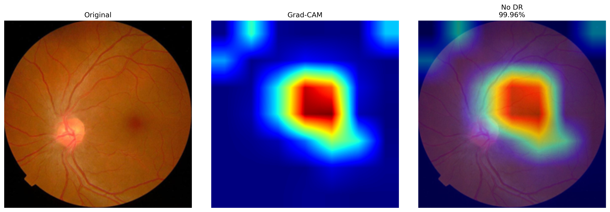
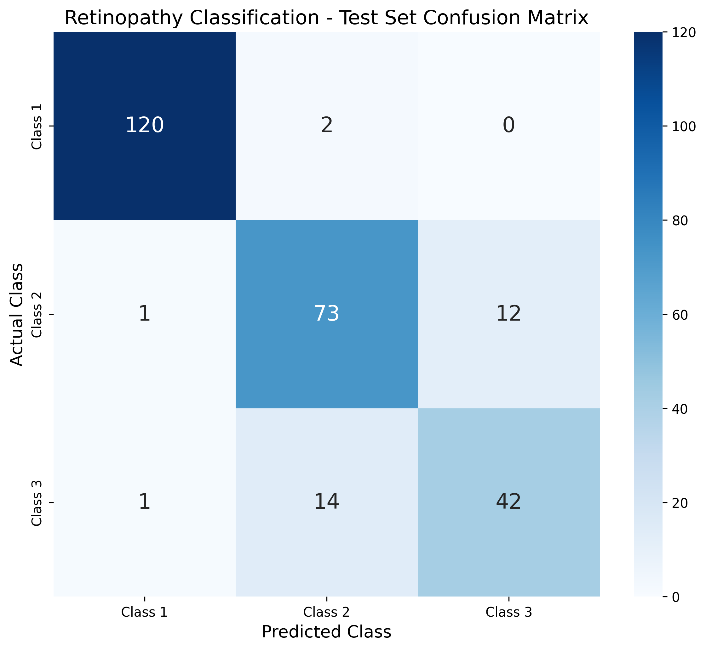
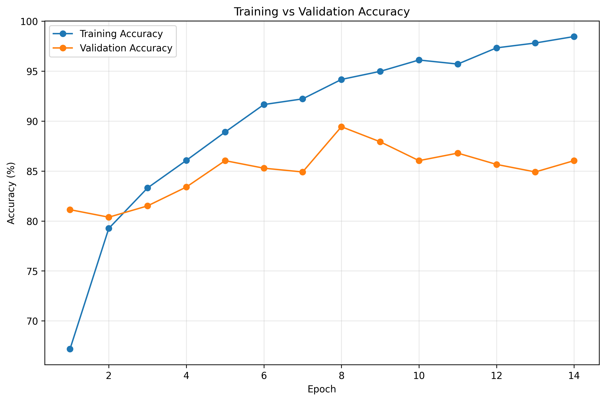
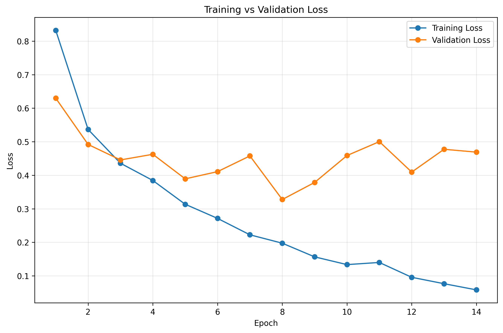
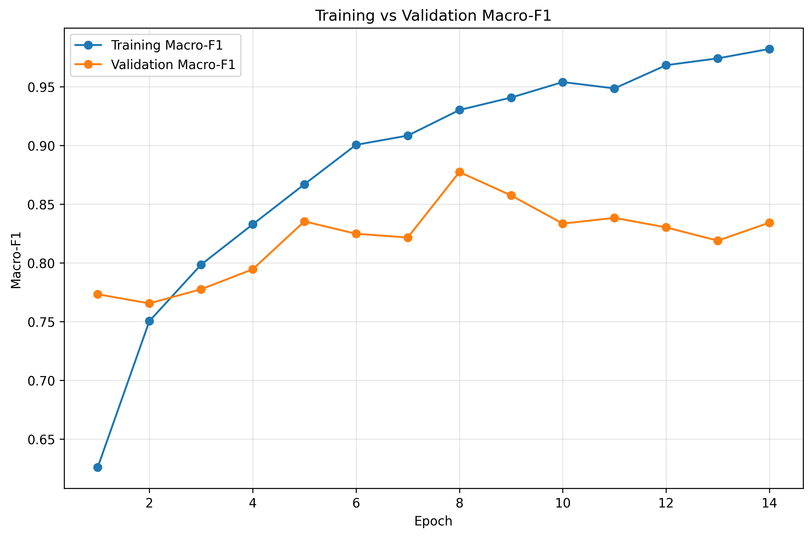

# 👁️ Diabetic Retinopathy Detection using ResNet-50

[](https://www.python.org/)
[](https://pytorch.org/)
[](https://arxiv.org/abs/1512.03385)
[](https://git-lfs.github.com/)

An end-to-end Deep Learning project for automated **Diabetic Retinopathy (DR)** severity classification from retinal fundus photographs using transfer learning with **ResNet-50**, enhanced with **Grad-CAM interpretability** for clinical explainability.

---

## 📌 Project Overview

- **Architecture:** ResNet-50 (Pretrained on ImageNet with customized classification head)
- **Input Dimensions:** 224 × 224 RGB
- **Classes (3 Categories):**
  - **Class 0 / 1:** No Diabetic Retinopathy (Normal)
  - **Class 1 / 2:** Mild to Moderate Diabetic Retinopathy
  - **Class 2 / 3:** Severe to Proliferative Diabetic Retinopathy
- **Training Strategy:** Transfer learning with AdamW optimizer, Weighted CrossEntropyLoss (to handle class imbalance), and robust data augmentations.

---

## 📊 Key Evaluation Metrics

The model was evaluated on an unseen test partition of **265 retinal images**:

| Metric | Score | Percentage |
| :--- | :---: | :---: |
| **Test Accuracy** | **0.8868** | **88.68%** |
| **Test Macro Precision** | **0.8605** | **86.05%** |
| **Test Macro Recall** | **0.8564** | **85.64%** |
| **Test Macro F1-Score** | **0.8582** | **85.82%** |
| **Best Validation Macro F1** | **0.8773** | **87.73%** |

### Per-Class Performance Breakdown

| Severity Class | Precision | Recall | F1-Score | Support (Images) |
| :--- | :---: | :---: | :---: | :---: |
| **No DR** | 98.36% | 98.36% | 98.36% | 122 |
| **Mild / Moderate DR** | 82.02% | 84.88% | 83.43% | 86 |
| **Severe / Proliferative DR** | 77.78% | 73.68% | 75.68% | 57 |

---

## 🧠 Model Interpretability (Grad-CAM)

To provide transparency into predictions, **Grad-CAM (Gradient-weighted Class Activation Mapping)** highlights key pathological features (microaneurysms, hemorrhages, exudates) driving the model's classification:



---

## 📈 Visualizations & Training Diagnostics

### Confusion Matrix


### Training & Validation Curves
| Accuracy Curve | Loss Curve | Macro F1 Curve |
| :---: | :---: | :---: |
|  |  |  |

---

## 📁 Repository Structure

```text
├── assets/                                      # Diagnostic and evaluation plots
│   ├── confusion_matrix.png
│   ├── gradcam_example.png
│   ├── training_validation_accuracy.png
│   ├── training_validation_loss.png
│   └── training_validation_macro_f1.png
├── results/                                     # Raw evaluation reports and CSVs
│   ├── Diabetic_Retinopathy_ResNet50_Final_Report.txt
│   ├── final_test_results.csv
│   ├── multiple_image_predictions.csv
│   ├── per_class_results.csv
│   ├── retinopathy_final_report.txt
│   ├── test_classification_report.csv
│   └── training_history.csv
├── best_retinopathy_resnet50.pt                 # Best trained model weights (Git LFS)
├── predict.py                                   # Inference CLI script
├── requirements.txt                             # Python dependencies
├── .gitattributes                               # Git LFS configuration
├── .gitignore                                   # Ignore caches and redundant archives
└── README.md                                    # Project documentation
```

---

## 🚀 Quick Start & Installation

### 1. Clone the Repository
Make sure you have [Git LFS](https://git-lfs.github.com/) installed:
```bash
git clone https://github.com/vkolhe501-blip/Diabetic-Retinopathy-ResNet50.git
cd Diabetic-Retinopathy-ResNet50
git lfs pull
```

### 2. Install Dependencies
```bash
pip install -r requirements.txt
```

### 3. Run Inference on a Retinal Image
```bash
python predict.py --image path/to/retinal_fundus_image.png --weights best_retinopathy_resnet50.pt
```

---

## ⚠️ Medical Disclaimer

This project is developed for educational and machine learning research purposes. Predictions generated by this model should **not** be used as a standalone medical diagnostic tool without verification by qualified medical professionals.